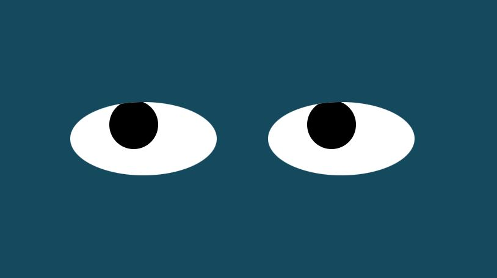

<link href="https://cdn.jsdelivr.net/npm/bootstrap@5.1.3/dist/css/bootstrap.min.css" rel="stylesheet" integrity="sha384-1BmE4kWBq78iYhFldvKuhfTAU6auU8tT94WrHftjDbrCEXSU1oBoqyl2QvZ6jIW3" crossorigin="anonymous">

<nav class="navbar navbar-expand-lg navbar-light bg-light">
  

      <ul class="navbar-nav">
        <li class="nav-item">
          <a class="nav-link active" aria-current="page" href="home.html">Home</a>
        </li>
        <li class="nav-item">
          <a class="nav-link" href="projects.html">Projects</a>
        </li>
      </ul>
    

</nav>

# Eyes Project
This project uses cursor detection to move the eyes on the screen to align with the location of the cursor.   
Click the image below to run the Eyes Project  
      
