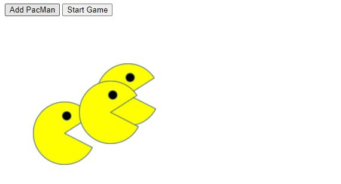

<link href="https://cdn.jsdelivr.net/npm/bootstrap@5.1.3/dist/css/bootstrap.min.css" rel="stylesheet" integrity="sha384-1BmE4kWBq78iYhFldvKuhfTAU6auU8tT94WrHftjDbrCEXSU1oBoqyl2QvZ6jIW3" crossorigin="anonymous">

<nav class="navbar navbar-expand-lg navbar-light bg-light">
  

      <ul class="navbar-nav">
        <li class="nav-item">
          <a class="nav-link active" aria-current="page" href="home.html">Home</a>
        </li>
        <li class="nav-item">
          <a class="nav-link" href="projects.html">Projects</a>
        </li>
      </ul>
    

</nav>

# Pac Men Game
This project is a small game that allows the user to add as many Pac Men as they want and send them racing in random directions with the click of a button.  This is similar to the real Pac Man game, only with no maze as a boundary.   
Click the image below to run the Pac Men Game.   

      
